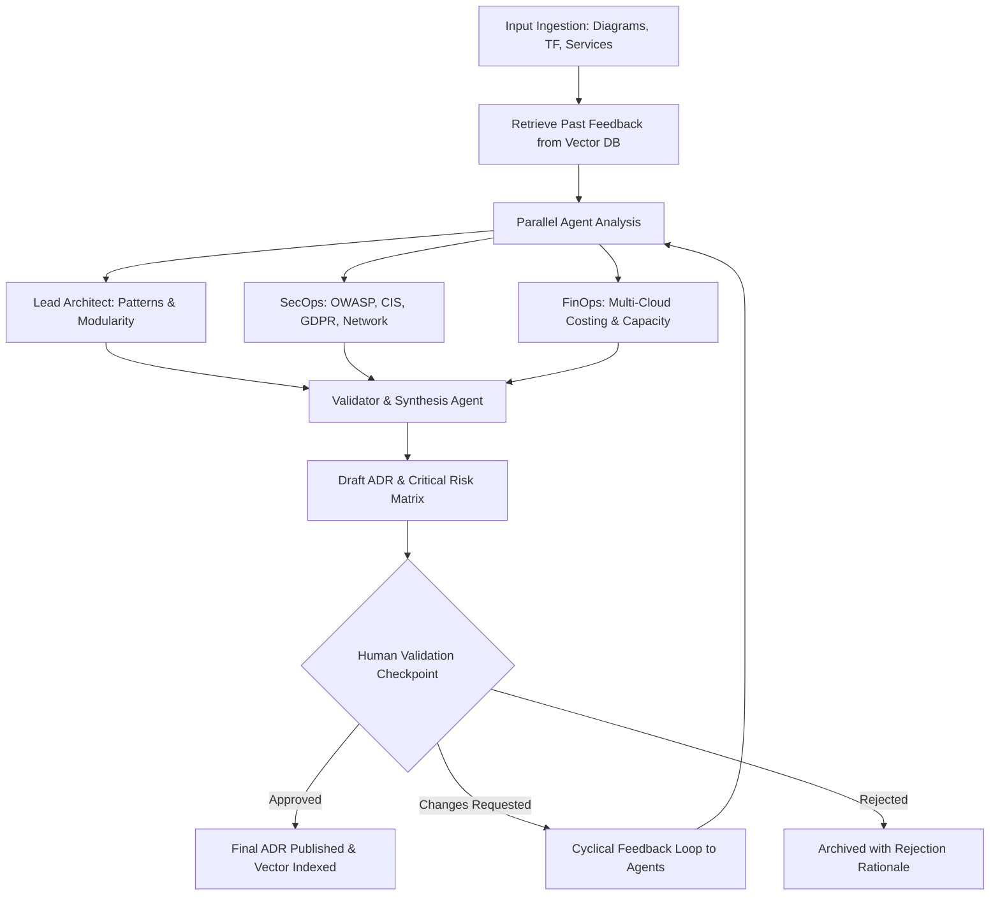

# Architecture Review Board (ARB) Skill

The **Architecture Review Board (ARB)** skill equips Antigravity with autonomous multi-agent review capabilities for evaluating system designs, infrastructure-as-code (Terraform), plain-text cloud service inventories, and architecture diagrams (Mermaid.js / Draw.io).

## Core Capabilities

1. **Multi-Cloud Architecture Assessment**:
   - **AWS, GCP, Azure, AliCloud, OVH**: Deep domain knowledge of multi-region deployment models, managed services, interconnects, and vendor lock-in mitigation.
2. **Specialized Agent Evaluation Matrix**:
   - **Lead Architect Agent**: Analyzes architectural patterns (CQRS, Event-Driven, Microservices vs. Modulith, Saga Pattern, Outbox Pattern) and domain boundaries.
   - **SecOps & Compliance Agent**: Enforces OWASP Top 10, CIS Benchmarks, GDPR, zero-trust network boundaries, public ingress/egress audits, and encryption at rest/transit.
   - **FinOps Agent**: Evaluates monthly cost models, capacity reservations, autoscaling economics, tiering, and serverless vs. provisioned workloads.
   - **Synthesis & Validator Agent**: Aggregates all stream findings into a standardized Architecture Decision Record (ADR), builds risk matrices, and orchestrates human validation in the loop.
3. **Continuous Learning & Few-Shot Feedback**:
   - Vector database memory (pgvector / Qdrant) retrieves past human operator ratings, corrections, and enterprise guidelines to steer current recommendations.

---

## When to Activate This Skill

Activate this skill when:
- The user provides an architecture diagram (Mermaid.js, Draw.io XML, or image) or asks to review a proposed system topology.
- The user pastes Terraform code or cloud resource lists for AWS, GCP, Azure, AliCloud, or OVH.
- The user asks for an **Architecture Decision Record (ADR)**, risk assessment, or cost/security audit.
- The user wants to run or manage the ARB multi-agent web application or docker container stack.

---

## Standard Multi-Agent Review Workflow



---

## Reference Runbooks

For detailed evaluation standards, refer to:
- [Well-Architected Framework Guide](./references/well_architected.md)
- [Security Baselines & Compliance](./references/security_baselines.md)
- [FinOps Principles & Multi-Cloud Costing](./references/finops_principles.md)

---

## CLI & API Quick Start

To launch the integrated ARB web application:
```bash
# 1. Start full Docker Compose stack (FastAPI Backend, UI, PostgreSQL, Qdrant)
docker-compose up -d

# 2. Access the Web Dashboard
open http://localhost:8000
```
