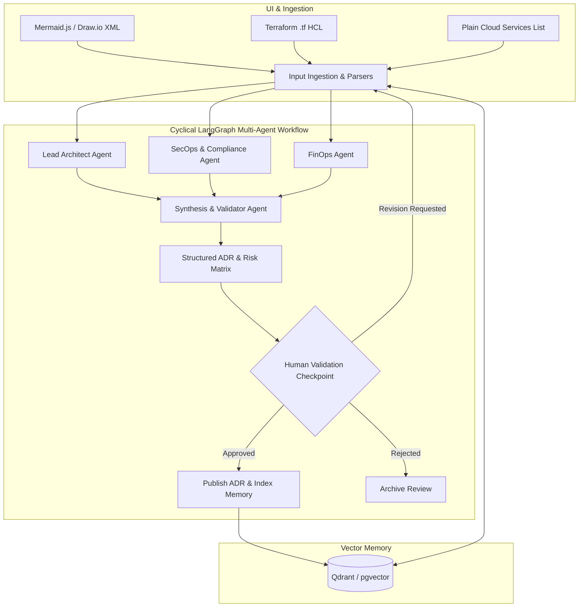

# Architecture Review Board (ARB) 🏛️🤖

[](docker-compose.yml)
[](https://fastapi.tiangolo.com)
[](https://langchain-ai.github.io/langgraph/)
[](LICENSE)

An enterprise-grade autonomous **Architecture Review Board (ARB)** multi-agent platform and custom **Antigravity Skill** evaluating complex system topologies across **AWS, GCP, Azure, AliCloud, and OVH**.

---

## Key Features

1. **Autonomous Multi-Agent Collaboration**:
   - **Lead Architect Agent**: Analyzes software patterns (CQRS, Event-Driven, Microservices vs. Modulith, Saga, Outbox) and domain boundaries.
   - **SecOps & Compliance Agent**: Audits against OWASP Top 10, CIS Benchmarks, GDPR sovereignty, network isolation, and ingress/egress filtering.
   - **FinOps Agent**: Forecasts monthly cloud spend, capacity planning, and autoscaling economics across AWS, GCP, Azure, AliCloud, and OVH.
   - **Synthesis & Validator Agent**: Generates standardized **Architecture Decision Records (ADRs)**, critical risk matrices, and manages human validation checkpoints.

2. **Cyclical Orchestration & Human-in-the-Loop (HITL)**:
   - Built on **LangGraph**, supporting cyclical review loops where human operators can request architectural revisions with custom guidelines.

3. **Central Multi-Provider LLM Router**:
   - Dynamic routing and fallback across **Google** (Gemini), **Anthropic** (Claude), **OpenAI** (GPT-4o), **Mistral AI**, and **AWS** (Bedrock).
   - Encrypted in-database API key storage with administrative controls.

4. **Continuous Learning & Vector Memory**:
   - Indexes past human feedback, ratings, and corrections into **Qdrant** / **pgvector**.
   - Agents query vector memory for historical lessons and corporate precedents before issuing decisions.

5. **Multi-Modal Input Ingestion**:
   - **Architecture Diagrams**: Mermaid.js text and Draw.io / diagrams.net XML.
   - **Infrastructure as Code**: Terraform `.tf` HCL parser.
   - **Cloud Services**: Plain-text cloud service lists and infrastructure inventories.

6. **Enterprise Administration & Access Control**:
   - Role-Based Access Control (**Admin** vs. **Reviewer**).
   - Support for **Local authentication**, **Generic SAML**, and **Okta OIDC**.
   - Global Architectural Tenets & Guidelines manager.

7. **On-Demand Antigravity Skill**:
   - Modular `.agents/skills/architecture-review-board/SKILL.md` packaging for zero-overhead on-demand loading in Google Antigravity.

---

## System Architecture



---

## Multi-Cloud Service Evaluation Matrix

| Capability | AWS | GCP | Azure | AliCloud | OVH |
| :--- | :--- | :--- | :--- | :--- | :--- |
| **Compute** | ECS / EKS / Lambda | Cloud Run / GKE | Container Apps / AKS | ACK / Function Compute | Managed K8s / VPS |
| **RDBMS** | RDS / Aurora | Cloud SQL / AlloyDB | Azure SQL | ApsaraDB RDS | Managed PostgreSQL |
| **NoSQL** | DynamoDB | Firestore / Bigtable | Cosmos DB | Tablestore | Managed Redis / MongoDB |
| **Messaging** | SQS / SNS / MSK | Pub/Sub | Event Hubs / Service Bus | RocketMQ / MNS | Managed Kafka |
| **Security** | AWS KMS / WAF | Cloud KMS / Armor | Key Vault / Azure WAF | AliCloud KMS | OVH KMS / Anti-DDoS |

---

## Quick Start Guide

### Option 1: Docker Compose (Recommended)

Start the entire production stack (FastAPI Backend, Web Dashboard, PostgreSQL with pgvector, and Qdrant vector database) in one command:

```bash
# 1. Clone the repository
git clone https://github.com/your-org/architecture-review-board.git
cd Architecture_Review_Board

# 2. Copy environment file
cp .env.example .env

# 3. Launch Docker Compose
docker-compose up -d --build

# 4. Open Web Application
# Navigate to: http://localhost:8000
```

### Option 2: Local Python Setup

```bash
# 1. Create and activate virtual environment
python -m venv venv
# On Windows:
venv\Scripts\activate
# On Linux/macOS:
source venv/bin/activate

# 2. Install dependencies
pip install -r requirements.txt

# 3. Start Application
uvicorn backend.app:app --host 0.0.0.0 --port 8000 --reload
```

---

## Running Automated Tests

Run the complete test suite covering parsers, agents, LangGraph orchestration, RBAC, and vector memory:

```bash
pytest -v
```

---

## API Endpoints Reference

### Authentication & Access Control
- `POST /api/auth/register` - Create user account with password strength validation.
- `POST /api/auth/login` - Authenticate and obtain signed JWT access token.
- `POST /api/auth/logout` - Audit session logout.
- `GET /api/auth/me` - Get current authenticated user profile & permissions.
- `POST /api/auth/change-password` - User self-service password update.
- `POST /api/auth/sso/init` - Initialize Okta / SAML login handshake.
- `GET /api/auth/sso/callback` - Complete SSO authorization callback.

### Multi-Agent Reviews
- `POST /api/reviews` - Start new architecture review with diagrams/TF/services.
- `GET /api/reviews` - List historical architecture reviews.
- `GET /api/reviews/{id}` - Retrieve review status and full ADR.
- `POST /api/reviews/{id}/validate` - Human operator validation (Approve / Revise / Reject).

### Build Target Cloud Architecture
- `POST /api/build/propose` - Propose target cloud architecture from text specifications across AWS, GCP, Azure, AliCloud, or OVH.
- `POST /api/build/propose-file` - Propose architecture with direct multipart document upload (Excel, PDF, Word).
- `POST /api/build/extract-file` - Parse and preview text from uploaded Excel (.xlsx/.xls), PDF (.pdf), or Word (.docx/.doc).
- `GET /api/build/sessions` - List historical cloud architecture build proposals.
- `GET /api/build/sessions/{id}` - Retrieve full proposal, components table, visual diagram, and Draw.io XML.
- `GET /api/build/sessions/{id}/drawio` - Download standardized Draw.io (.drawio) XML file.
- `GET /api/build/sessions/{id}/tad` - Download complete Technical Architecture Document (TAD) in Markdown.
- `DELETE /api/build/sessions/{id}` - Delete historical architecture build session.

### Continuous Learning & Vector Memory
- `POST /api/feedback` - Submit human rating, comments, and corrections (auto-indexed to Qdrant).
- `GET /api/feedback/history` - View historical feedback and vector indexing status.

### Administration & User Management
- `GET /api/admin/users` - List users with query search, role, and active status filters.
- `POST /api/admin/users` - Admin direct user creation with role and password assignment.
- `GET /api/admin/users/{id}` - Get full user account metrics and details.
- `PUT /api/admin/users/{id}` - Update user details (name, email, role, status) with safety protections.
- `PUT /api/admin/users/{id}/status` - Enable or disable user account (preventing self-lockout).
- `PUT /api/admin/users/{id}/role` - Update Admin vs Reviewer permissions.
- `POST /api/admin/users/{id}/reset-password` - Administrative password reset.
- `DELETE /api/admin/users/{id}` - Permanently delete user with foreign-key preservation.
- `GET /api/admin/audit-logs` - Query security and administration event audit trail.
- `GET /api/admin/stats` - Overview KPI metrics for user administration.
- `GET / PUT /api/admin/providers/{name}` - Toggle LLM providers and update encrypted API keys.
- `GET / POST / PUT / DELETE /api/admin/guidelines` - Manage, update, toggle, and audit corporate architecture rules and tenets.
- `GET / POST / PUT / DELETE /api/admin/sources` - Manage, ingest, and bind reference sources (Excel, PDF, Word, URL) globally and per agent.
- `GET / PUT /api/admin/sso` - Configure Okta OIDC, domain, client credentials, and callback URI.

---

## Antigravity Skill Loading

To activate ARB within Google Antigravity:
```markdown
Skill located at: `.agents/skills/architecture-review-board/SKILL.md`
Loads on demand to prevent memory saturation and provides instant architecture review procedures.
```
